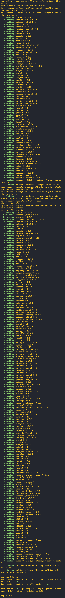
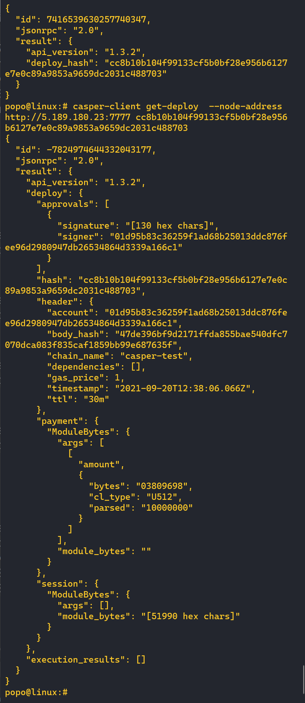
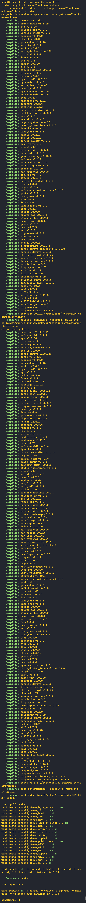
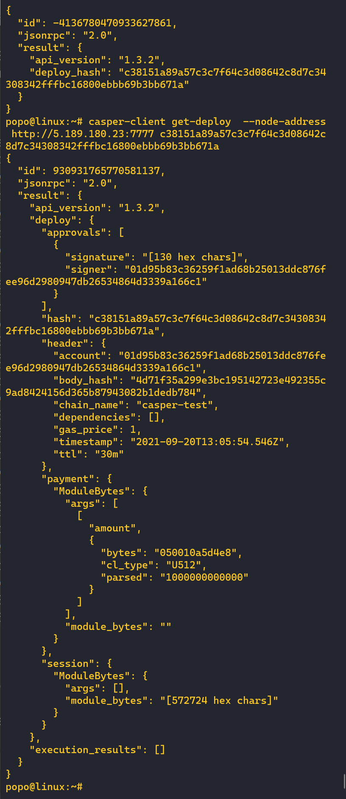
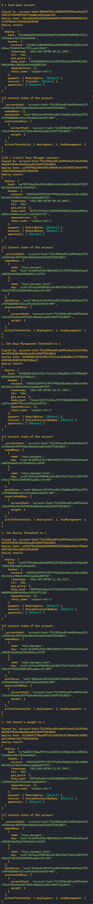
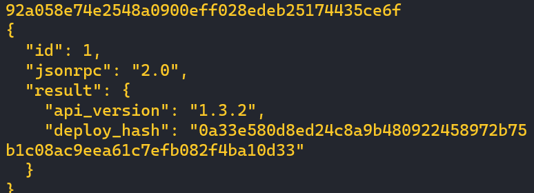
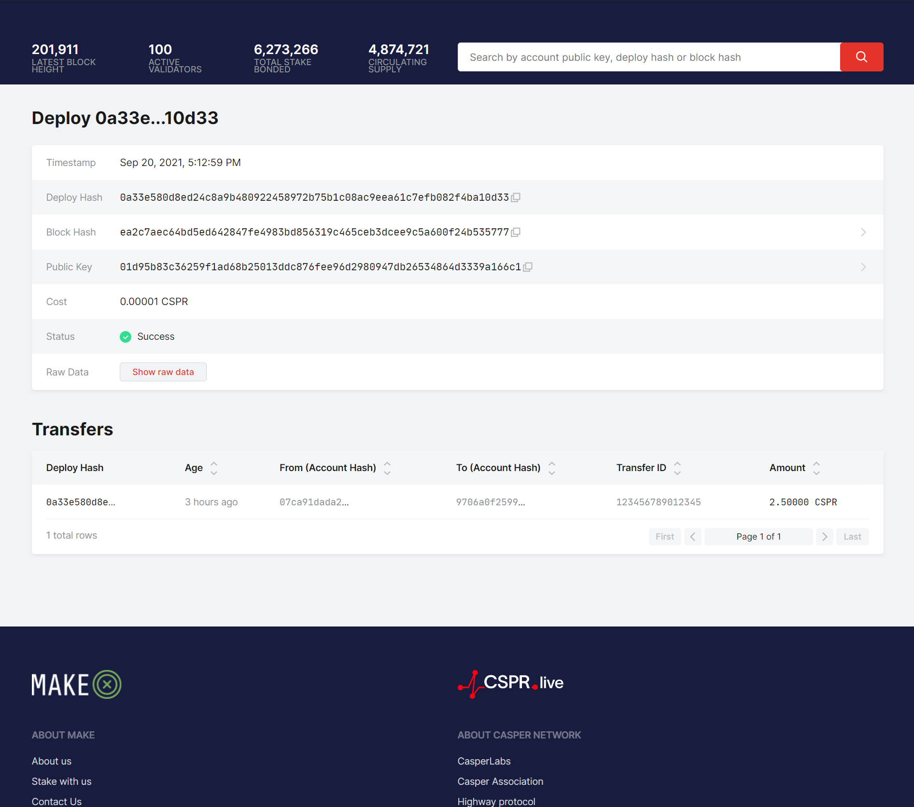
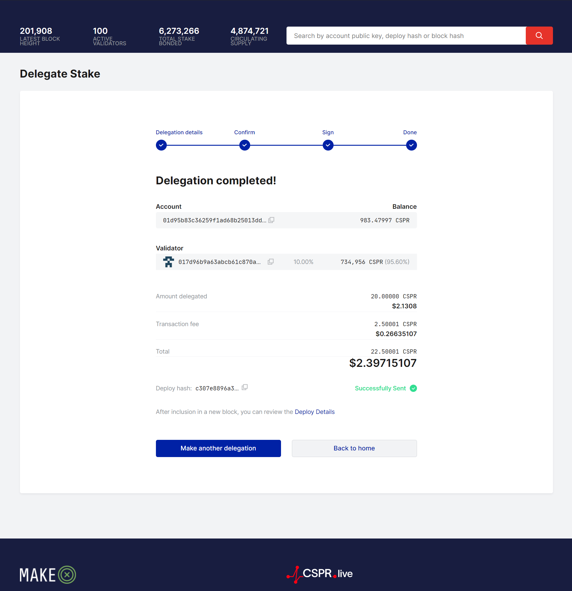
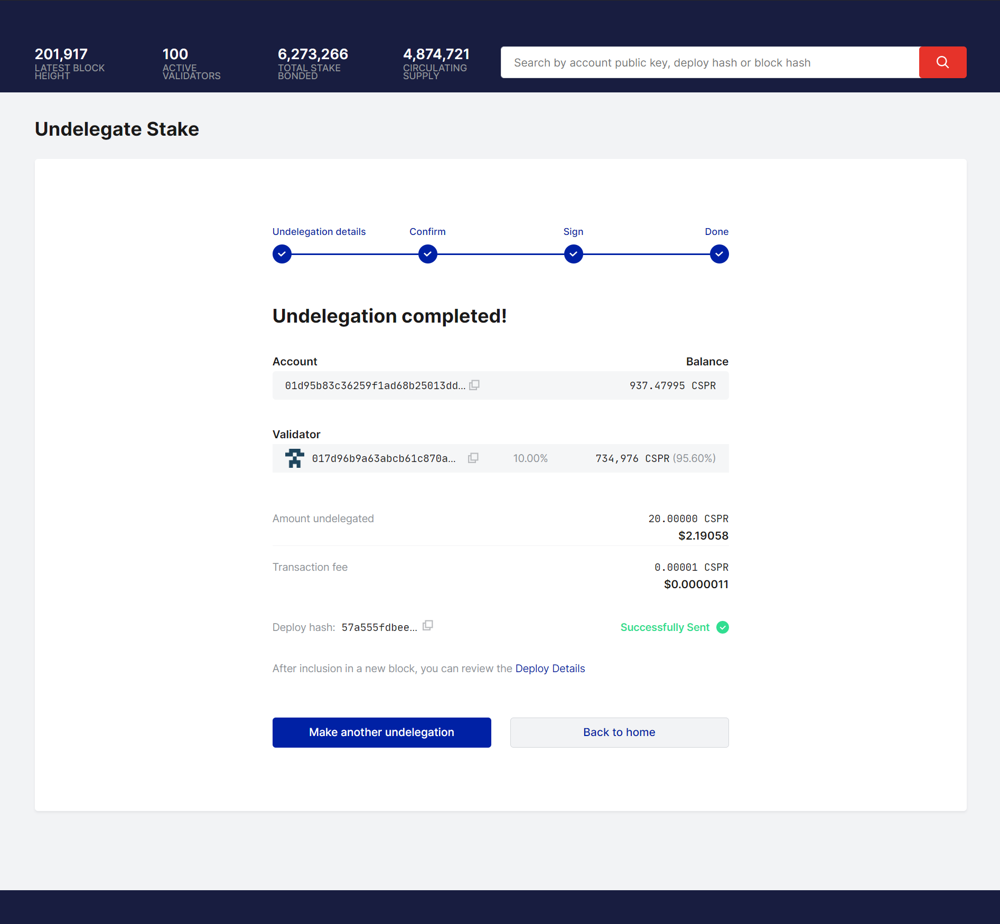

# Get Started With Casper (First 100 Submissions)


## 1. Create and deploy a simple, smart contract with cargo casper and cargo test


### The screenshot of build and test





### The screenshot of deploying the contract to testnet and The screenshot of the deployment status:





## 2. Complete one of the existing tutorials for writing smart contracts
 I chose the "Key-Value Storage Tutorial".

Build and test successfully



Deployed smart contract and the deployment status




## 3. Demonstrate key management concepts by modifying the client in the Multi-Sig tutorial to address one of the additional scenarios

Scenario 1: signing transactions with a single key

The code
```
const keyManager = require('./key-manager');

(async function () {
    // 1. Weight of `fullAccount` to 2
    // 2. Key Management Threshold to 2
    // 3. Deploy Threshold to 1
    // 4. First new key with weight 1 (deploy key)

    let deploy;

    // 0. Initial state of the account.
    // There should be only one associated key (faucet) with weight 1.
    // Deployment Threshold should be set to 1.
    // Key Management Threshold should be set to 1.
    let masterKey = keyManager.randomMasterKey();
    let fullAccount = masterKey.deriveIndex(1);    


    console.log("\n0.1 Fund main account.\n");
    await keyManager.fundAccount(fullAccount);
    await keyManager.printAccount(fullAccount);
    
    console.log("\n[x]0.2 Install Keys Manager contract");
    deploy = keyManager.keys.buildContractInstallDeploy(fullAccount);
    await keyManager.sendDeploy(deploy, [fullAccount]);
    await keyManager.printAccount(fullAccount);


    
    // 1. Set Keys Management Threshold to 1.
    console.log("\n1. Set Keys Management Threshold to 1\n");
    deploy = keyManager.keys.setKeyManagementThresholdDeploy(fullAccount, 1);
    await keyManager.sendDeploy(deploy, [fullAccount]);
    await keyManager.printAccount(fullAccount);
    
    // 2. Set Deploy Threshold to 1.
    console.log("\n2. Set Deploy Threshold to 1.\n");
    deploy = keyManager.keys.setDeploymentThresholdDeploy(fullAccount, 1);
    await keyManager.sendDeploy(deploy, [fullAccount]);
    await keyManager.printAccount(fullAccount);
    
    // 3. Set fullAccount's weight to 1
    console.log("\n3. Set faucet's weight to 1\n");
    deploy = keyManager.keys.setKeyWeightDeploy(fullAccount, fullAccount, 1);
    await keyManager.sendDeploy(deploy, [fullAccount]);
    await keyManager.printAccount(fullAccount);
    
})();


```

### Final result:


## 4. Learn to transfer tokens to an account on the Casper Testnet. Check out this documentation.
### Screnshot of transfering tokens and deployment status:





## 5.Learn to Delegate and Undelegate on the Casper Testnet. Check out these instructions.






